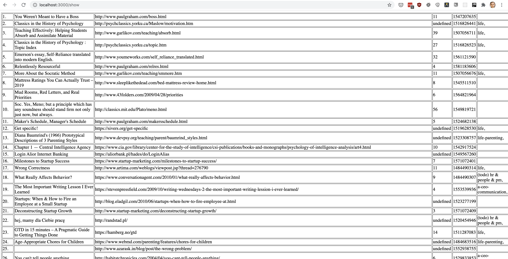

# Show Pocket links in a table

### Motivation:

A straightforward script to show getpocket.com articles as a table, to import them in Google Spreadsheet or Microsoft Excel.

I wanted to review my entire Pocket articles library in a spreadsheet
and didn't find any solution. So I made it ;)

Also, I need to archive all Pocket links because I put proper articles in Roam Research now.

### Configure & run:

Install node.js

Run `npm install`

Generate consumer key https://getpocket.com/developer/apps/

Add consumer key for example as `.pocketrc` file

```
[pocket]
  consumerKey  = 93466-9a86aad2ffff0fewfc278f73e
```

Run `node app.js`

### Additional features:

- Archive all links `/archive_all`
